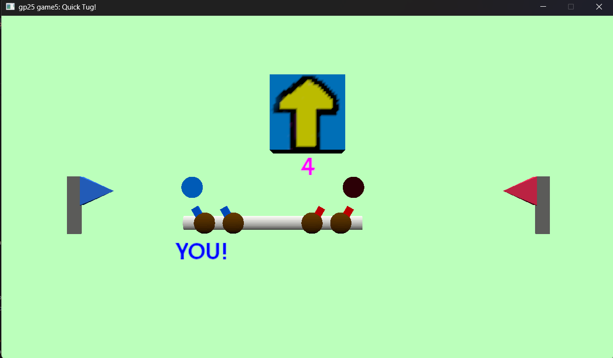

# Quick Tug

Author: Kenechukwu Echezona

Design: A game of tug of war, controlled by competitive quick time events.

Networking: The networking structure is mostly unchanged from the base code, but in order to send and receive the correct information between server and client, I had to spend some time studying how it worked initially, and how/why certain values were sent and received.
- Clients transmit directional inputs (determined by `handle_event` in `PlayMode`) to the server via a `PlayMode` call to the client's `controls`' `send_controls_message` method. The `controls` object in the server receives these inputs in `Game::Players::Controls::recv_controls_message` via a server poll, and the server uses these inputs in `game.update` to update the game state.
- After updating (via polling), server tells its `game` object to send the game state back to each client. This involves sending the state of each player, as well as the `progress` of the rope, the current `triggerDirection`, and the `gameState` (as in, the state machine), all through `game.send_state_message`. The client polls in `PlayMode::update`, where the `game` receives the message sent by the server, and uses `game.recv_state_message` to update the local `game` object with this message.
- Luckily for me, the only information that actually needed to be transfered were plain-old data types (including enumerated types, which I explicitly defined numbers for).

The server itself does two passes over the game state:
- The first pass processes all the inputs together under the current game state, to determine how both the game state and individual player data should change. I use a nextState variable to handle things like ties between the players. It's sort of like processing the inputs as one input.
- The second pass reasons on this new state and data, incrementing timers and handling state transitions from this new state.
PlayMode handles drawing based on the game state in `game`.
Without this approach, utilizing the given structure, problems would arise. For example, timers would increment faster if handled in the loop of players unless I normalized the time user player size; but why not just do that stuff outside of the loop?

The game only supports two players at once; in addition to the list of players, I keep a static `activePlayerCount` and gave every `Player` a boolean member called `activePlayer`. If more players than two players join, the game will make them spectators (basically treating them like a player whose inputs don't matter). A player dropping out will have them be replaced by the spectator who joined earliest.

Screen Shot:

How To Play:
- WASD: Up/Left/Down/Right
- When the arrow appears, press in that direction before your opponent to start pulling on the rope.
- If you win the QTE, you'll keep pulling the rope. Press the same direction to stop pulling.
- If you lose the QTE, you can initiate a Counter by pressing in the opposite direction. Successfully Countering before your opponent stops pulling will undo all of their progress for that particular interaction, and grant you a bonus 20% of the progress they had made!
- Be the first to pull the rope to your side!

Strategy:
- While having a better reaction time than your opponent is helpful, the true key to victory in Quick Tug Event lies in the mind games.
- If you win a QTE, consider how long it'll take for your opponent to 1) react to losing the QTE, and 2) determine the right button to counter. If you get too greedy and underestimate your opponent, you can lose a lot of progress!
- Not all is lost if your opponent has a better reaction time! If you're aware that your opponent reacts faster than you, then you can mentally prepare yourself to Counter before they do, essentially skipping those early steps.
- Of course, if you suspect that your opponent has a trigger finger, you can bait them into a False Start, netting you a ton of progress!
- When you Counter, you not only undo your opponents progress, but even gain a percentage of the progress they made, so sometimes it might be worth it to delay your Counter.
- Be aware of the Tug Clock. It should really only matter if you're turtling (ending your pulls very quickly), but it can set you back if you aren't careful!

Sources:
- Font used: [Google Font Hammersmith One](https://fonts.google.com/specimen/Hammersmith+One?preview.text=Select%20a%20cone%20type!&query=nic)

This game was built with [NEST](NEST.md).

